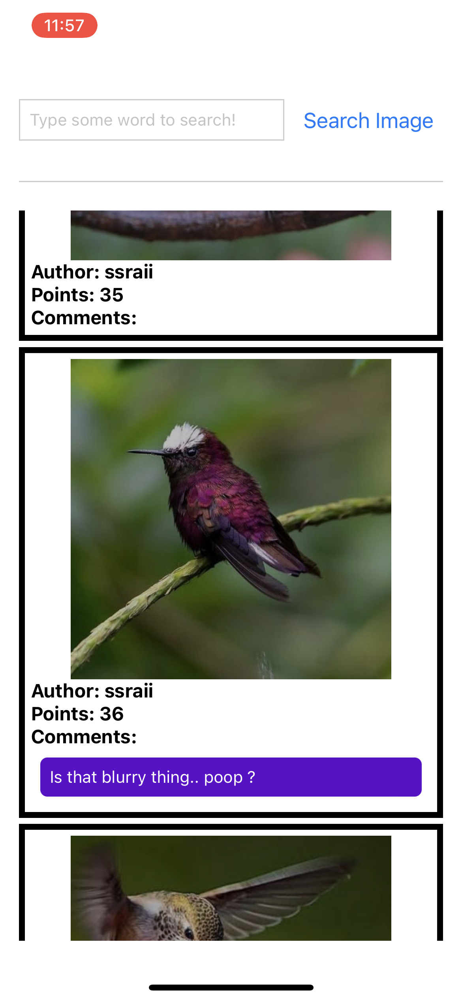

### Abstract

This repository shows how imgur API works with React-Native application.

### Setup

#### Installation

##### Computer side

First install Node.js into your computer.

After installing Node.js successfully, run the following command to install Expo CLI

    npm install -g expo-cli
    
and then run the project with following command

    npm start
    
The program would start, and you would see an QR code showing on the terminal

##### Phone side

Download `Expo Go` on Apple store or Google Play Store. 

Then scan the QR code in terminal with camera or QR code scanning app.

Finally, open it in `Expo Go` and you can interact with the program via your phone!

#### Imgur API setup

1. Go to the [official Imgur documentation site](https://apidocs.imgur.com/)
2. Following the instruction and register an application.
3. In Authorization type, choose OAuth 2 authroization without a callback URL.
4. Get client-id and client-secret (We only use client-id).
5. Head to `util/http.js`, and replace the value of `CLIENT_ID` with yours in line 6.

### Function

#### Step

1. Type the word in TextInput
2. Press `Search Image`
3. The program would show a series of images, with the author, comment and points.
4. If there is no result, the bottom part would remain blank.

#### Demo

##### Search

##### Output Page

##### Blank Result

